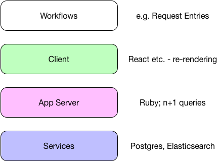

---

# Perf (mostly SQL)

### Lunch & Learn Apr 20, 2017

##### Venky Iyer

---

# Overview

+++

 * Identifying perf problems
 * Montage: SQL operations/internals
 * What affects SQL query performance
 * EXPLAIN output
 * Redshift SQL & Hive SQL

<!-- Caveats about I am not an expert -->

--- 

Where in the stack is the perf bottleneck?

+++

---

