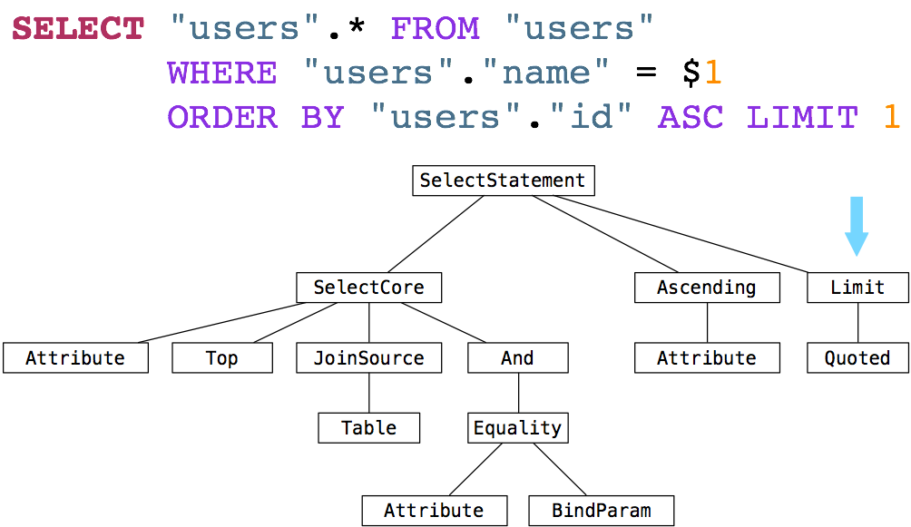

---

# Perf, SQL, etc.

### Lunch & Learn Apr 20, 2017

##### Venky Iyer

---

## Overview

+++

 * Identifying perf problems
 * Montage: SQL operations/internals
 * What affects SQL query performance
 * EXPLAIN output
 * Redshift SQL & Hive SQL

<!-- Caveats about I am not an expert -->

---

## Where in the stack is the perf bottleneck?


---

## The optimization loop


---

## Profilers


---

🐻

---

## NewRelic

+++

### Apdex = % satisfactory response times

* satisfying < tolerable (T) < frustrating (4T)
* Global setting of T = 300ms
* Response time setting to record "traces" >= 4T
* Can be changed on per-transaction level (for key transactions)

+++

### Custom instrumentation

Set or modify transaction names:

```ruby
  def contacts_results(search_term, tags, page_number: 0, paginate: true)
    transaction_name = NewRelic::Agent.get_transaction_name
    if search_term.blank?
      NewRelic::Agent.set_transaction_name("#{transaction_name} - empty")
    elsif UserConfig.value_for_user_id_and_key(@user.id, 'experimental-search').to_b
      NewRelic::Agent.set_transaction_name("#{transaction_name} - experimental")
    elsif search_term.split(/\s+/).length > 3
      NewRelic::Agent.set_transaction_name("#{transaction_name} - long")
    end
```
+++

Measure a block:

```ruby
   include ::NewRelic::Agent::MethodTracer

   self.trace_execution_scoped(['MessageThreadTagsController/log_work_action']) do
     log_work_action(:message_thread_tagged, message_thread_tag, client_created_at: nil, thread_id: params[:message_thread_id].to_i)
   end
```

+++

Split out a method:

```ruby
add_method_tracer :contacts_results, 'ClientSearch/contacts_results'
```

+++

[notes]

* transactions
* traces
* database
* dashboards
* throughput v. slow queries
* percentiles

---

## Profiling Ruby

+++

`!debug`

* Turn log level to DEBUG (shows Elasticsearch queries)
* Pipe the ActiveRecord query logs to STDOUT
* shows backtraces etc

[demo]

---

[`.pryrc`](https://github.com/finventures/fin-core-beta/blob/master/.pryrc)

Custom commands:

* debugger
* `dp` | `ep`
* backtrace
* autocompleter
* prompt

---

`Benchmark`

```ruby

rails> Benchmark.bm do |x|
*   x.report { User.find(2) }
* end
  user     system      total        real
  0.020000   0.010000   0.030000 (  0.031872)


rails> Benchmark.realtime { User.find 2 }
=> 0.004197215981548652

```

+++

`RubyProf`


```ruby

> result = RubyProf.profile { AgentState.event_loop }
> printer = RubyProf::CallStackPrinter.new(result)
> printer.print(open("./profile2.html", "w"))

$> open profile2.html

```

---

🌝

---

# SQL

* Declarative (v. imperative). cf. `select, map, group_by` v. `for` loops
* __Structured English Query Language__ (`SEQUEL`) -> `SQL`
* Ingres(s) (Berkeley) -> Postgres (1980's)

+++

[EF Codd, a Relational Algebra](http://www.morganslibrary.net/files/codd-1970.pdf)

### Relation

<blockquote>
Given sets X1 , S1, S2, . . , S, (not necessarily
distinct), R is a relation on these n sets if it is a set of ntuples
each of which has its first element from S1, its
second element from Sz , and so on.
</blockquote>


+++

## What is ACID-compliance?

* Atomicity: Transaction that rolls back completely or commits completely
* Consistency: Transaction rolls back on trigger failure or validation violation
* Isolation: Concurrent transactions
* Durability: Write-ahead log

---

### MVCC

* Every transaction has an id (`xid`)
* Every row can have multiple versions, each has an `(xmin, xmax)`
* Rows are only visible for read to `xid IN [xmin, xmax]`
* `INSERT`: create version with `xmin = xid`
* `DELETE`: create version with `xmax = xid`
* `COMMIT`: set `committed[xid] = true`
* Always read latest visible committed version

+++

## Rollbacks

* Can leave versions lying around, bloating the db and indexes
* `VACUUM` cleans these up
* Postgres has `auto_vacuum`. Tuning frequency of vacuuming (& analyzing) is a
  big deal for perf

+++

## xid Wraparound

* `xid` is 32-bit integer (2^32 = 4 billion)
* If it wraps around -> 0, all rows have `xmin` > `xid` and become visible 💥
* Need to `VACUUM FREEZE` to set `xmin` to sentinel value

---

## Write-ahead logs

* Every `COMMIT`, write a binary log of the changes made to data
* Regularly __checkpoint__, ie. flush to durable storage

1. Crash recovery: find last checkpoint and replay
2. Replication: ship binary log over and replay

+++

## Log-table duality

<blockquote>
Logs are tables in motion -- Jay Kreps
</blockquote>

cf. Streams (Kafka/Kinesis etc.)

---

🐡

---

### `ActiveRecord`, `arel` etc

(Pat Shaughnessy)


+++


+++



---

👾

---

### The Database

+++


+++

### Parser → Rewriter → Optimizer → Cost analysis → Execute

+++


+++

### Rewriter

Replace Views with underlying query tree

+++

### Optimizer

* How to scan tables
  * e.g. Sequential, Index
* How to join tables (and in what order)
  * e.g. Hash, Merge
* Inlining, predicate pushdown etc

📌

+++


+++

### Cost analysis across many possible plans

`postgresql.conf`

```
seq_page_cost = 1.0                    # Read 8K Page from disk sequentially
random_page_cost = 4.0                 # Random I/O
cpu_tuple_cost = 0.01                  # Process a row
cpu_index_tuple_cost = 0.005           # Process an index entry
cpu_operator_cost = 0.0025             # Perform an operation

```

Goal: Find a good plan fast enough so that it actually matters

+++

### Statistics

* Estimate # of rows returned by query (each step in plan)
* `ANALYZE` updates statistics
* `auto_vacuum` runs `ANALYZE`
  * `n_distinct`,
  * `most_common_vals` (and their frequencies),
  * `histogram_bounds` (distribution of values)

👎  Assumes independence of columns

+++

### Executor

* stream-processing style dependency graph
* Parent node _pulls_ on its children
* i.e. time to first row matters, as does generating all rows

---

🥑

---

## Tables and Indexes


---

## Reading a table

* Cost depends on how much data you're reading
* Index reads are random and expensive (but you can read only what you want)
* Sequential reads are cheap (but you have to read all of it)

+++

## Sequential scan

(when _selectivity_ is low)


+++

```sql
explain analyze
select id from users where id is not null;

Seq Scan on users  (cost=0.00..992.41 rows=3241 width=4)
  Filter: (id IS NOT NULL)
```

+++

## Index scan

(when _selectivity_ is high)


+++

```sql
explain
select id from users where id=2;

Index Only Scan using users_pkey on users  (cost=0.28..8.30 rows=1 width=4)
  Index Cond: (id = 2)

```

+++

🍩  Index-_only_ scans: when **all** columns involved are indexed

```sql
explain
select * from users where id=2;

Index Scan using users_pkey on users  (cost=0.28..8.30 rows=1 width=1713)
  Index Cond: (id = 2)
```

+++

## Bitmap Index Scan + Bitmap Heap Scan

(when _selectivity_ is intermediate)


+++

```sql

explain
select * from users where id > 20 and id < 50;

Bitmap Heap Scan on users  (cost=4.53..89.50 rows=24 width=1713)
  Recheck Cond: ((id > 20) AND (id < 50))
    ->  Bitmap Index Scan on users_pkey  (cost=0.00..4.52 rows=24 width=0)
            Index Cond: ((id > 20) AND (id < 50))

```

🍫  can combine multiple indices
---

🔬

---

## `EXPLAIN`

* `EXPLAIN`: plan + estimated costs
* `EXPLAIN ANALYZE`: plan + estimated costs + *actual* costs after execution
* `EXPLAIN (ANALYZE, COSTS, VERBOSE, BUFFERS, FORMAT JSON)` : more stats about
  how much data was read etc.


+++

```

(cost=4.53..89.50 rows=24 width=1713)

(actual time=0.007..0.133 rows=100 loops=1)

```

* starting cost / actual starting time
* total cost / actual total time
* rows
* width
* loops


+++

### Control row estimates through statistics target


```
show default_statistics_target
100
```

```
SELECT attname, attstattarget
FROM   pg_attribute
WHERE  attrelid = 'entry_properties'::regclass;

----------------
entry_id    10000
schema_id    10000
serialized_value    10000
...

```

`ALTER TABLE SET STATISTICS`

---

## Joins 🙏

+++

### Nested loop join with Sequential scan


(small tables)

+++

### Nested loop join with Index scan


+++

### Hash join


+++

### Merge join


---
