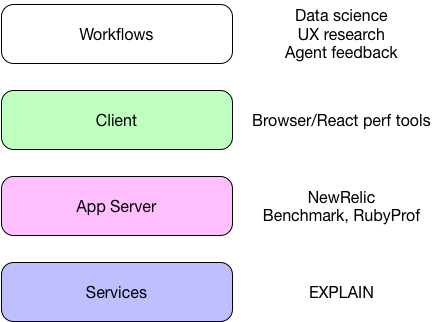

---

# Perf, SQL, etc.

### Lunch & Learn Apr 20, 2017

##### Venky Iyer

---

## Overview

+++

 * Identifying perf problems
 * Montage: SQL operations/internals
 * What affects SQL query performance
 * EXPLAIN output
 * Redshift SQL & Hive SQL

<!-- Caveats about I am not an expert -->

---

## Where in the stack is the perf bottleneck?


---

## The optimization loop


---

## Profilers




---

🐻

---

## NewRelic

+++

### Apdex = % satisfactory response times

* satisfying < tolerable (T) < frustrating (4T)
* Global setting of T = 300ms
* Response time setting to record "traces" >= 4T
* Can be changed on per-transaction level (for key transactions)

+++

### Custom instrumentation

Set or modify transaction names:

```ruby
  def contacts_results(search_term, tags, page_number: 0, paginate: true)
    transaction_name = NewRelic::Agent.get_transaction_name
    if search_term.blank?
      NewRelic::Agent.set_transaction_name("#{transaction_name} - empty")
    elsif UserConfig.value_for_user_id_and_key(@user.id, 'experimental-search').to_b
      NewRelic::Agent.set_transaction_name("#{transaction_name} - experimental")
    elsif search_term.split(/\s+/).length > 3
      NewRelic::Agent.set_transaction_name("#{transaction_name} - long")
    end
```
+++

Measure a block:

```ruby
   include ::NewRelic::Agent::MethodTracer

   self.trace_execution_scoped(['MessageThreadTagsController/log_work_action']) do
     log_work_action(:message_thread_tagged, message_thread_tag, client_created_at: nil, thread_id: params[:message_thread_id].to_i)
   end
```

+++

Split out a method:

```ruby
add_method_tracer :contacts_results, 'ClientSearch/contacts_results'
```

+++

[notes]

* transactions
* traces
* database
* dashboards
* throughput v. slow queries
* percentiles

---

## Profiling Ruby

+++

`!debug`

* Turn log level to DEBUG (shows Elasticsearch queries)
* Pipe the ActiveRecord query logs to STDOUT
* shows backtraces etc

[demo]

---

[`.pryrc`](https://github.com/finventures/fin-core-beta/blob/master/.pryrc)

Custom commands:

* debugger
* `dp` | `ep`
* backtrace
* autocompleter
* prompt

---

`Benchmark`

```ruby

rails> Benchmark.bm do |x|
*   x.report { User.find(2) }
* end
  user     system      total        real
  0.020000   0.010000   0.030000 (  0.031872)


rails> Benchmark.realtime { User.find 2 }
=> 0.004197215981548652

```

+++

`RubyProf`


```ruby

> result = RubyProf.profile { AgentState.event_loop }
> printer = RubyProf::CallStackPrinter.new(result)
> printer.print(open("./profile2.html", "w"))

$> open profile2.html

```

---

🌝

---

# SQL

* Declarative (v. imperative). cf. `select, map, group_by` v. `for` loops
* __Structured English Query Language__ (`SEQUEL`) -> `SQL`
* Ingres(s) (Berkeley) -> Postgres (1980's)

+++

* [EF Codd, a Relational Algebra](http://www.morganslibrary.net/files/codd-1970.pdf)

## Relation


<quote>
Given sets X1 , S, , . . . , S, (not necessarily
distinct), R is a relation on these n sets if it is a set of ntuples
each of which has its first element from S1, its
second element from Sz , and so on.
</quote>


+++

## What is ACID-compliant?

* Atomicity: Transaction that rolls back completely or commits completely
* Consistency: Transaction rolls back on trigger failure or validation violation
* Isolation: Concurrent transactions
* Durability: Write-ahead log

+++

MVCC: Multi-version concurrency control (perspectives!)

* Every transaction has an id (`xid`)
* Every row can have multiple versions, each has an `(xmin, xmax)`
* Rows are only visible for read to `xid IN [xmin, xmax]`
* `INSERT`: create version with `xmin = xid`
* `DELETE`: create version with `xmax = xid`
* `COMMIT`: set `committed[xid] = true`
* Always read latest visible committed version

+++

## Rollbacks

* Can leave versions lying around, bloating the db and indexes
* `VACUUM` cleans these up
* Postgres has `auto_vacuum`. Tuning this is a big deal for perf

+++

## xid Wraparound

* `xid` is 32-bit integer (2^32 = 4 billion)
* If it wraps around -> 0, all rows have `xmin` > `xid` and become visible 💥
* Need to `VACUUM FREEZE` to set `xmin` to sentinel value

---
